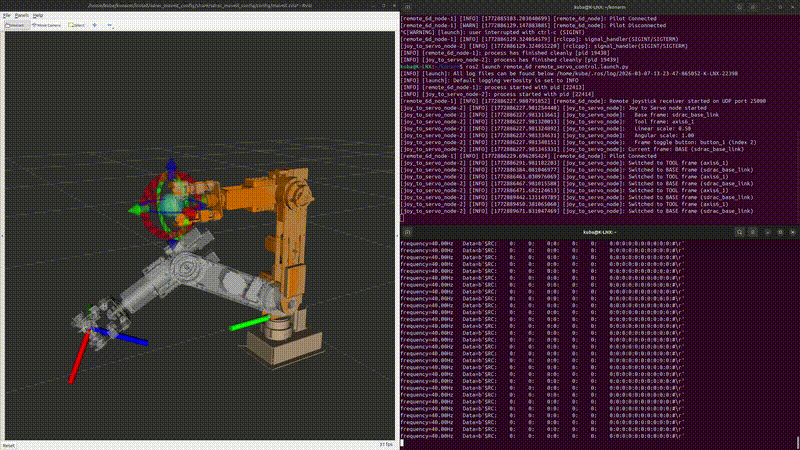

# 6 DOF ARM-Manipulator Controler
Repo with all the required code to control the 6 DOF arm-manipulator.


### Quick Start
1. Build the workspace:
```bash
colcon build --symlink-install
```
2. Source the workspace:
```bash
source install/setup.bash
```
3. Launch the driver:
```bash
ros2 launch konarm_bringup develop_rc.launch.py
```

### Launch Arguments
You can pass the `use_sim_hardware` parameter to the launch file:

**Example: Use simulated hardware**
```bash
ros2 launch konarm_bringup develop_rc.launch.py use_sim_hardware:=true
```

**Default (real hardware):**
```bash
ros2 launch konarm_bringup develop_rc.launch.py
```
### Base launch file
The base launch file is `develop_rc.launch.py` located in `src/konarm_bringup/launch/`. It includes the:
- `konarm_driver` node for the arm controller.
- `konarm_state_publisher` node for  urdf, TF and joint state publishing.
- `konarm_basic_joystick_driver` node for 6 axis joystick controller (only shouel be used when directly controlling the robot with a joystick, not recommended for use with MoveIt or other high level planners).
- `remote_6d` node responsible for connecting with the remote joystick controllers.


## Parameters
can also be set using the config gile in `src/konarm_bringup/config/konarm_driver_parameters.yaml`
| Parameter Name | Type | Default Value | Description |
|----------------|------|---------------|-------------|
| `frame_id` | string | `"konarm"` | TF frame ID for published joint states |
| `can_interface` | string | `"can0"` | CAN interface name (e.g., can0, vcan0) |
| `control_loop_hz` | double | `75.0` | Control loop frequency in Hz |
| `error_get_hz` | double | `2.0` | Frequency for requesting error frames from joints |
| `timeout_s` | double | `0.5` | Connection timeout in seconds |
| `msg_timeout` | double | `0.5` | Control message timeout in seconds |
| `use_sim_time` | bool | `false` | **Enable simulation mode** (no hardware required) |
| `use_sim_hardware` | bool | `false` | **Enable simulated hardware mode** (no physical CAN interface required) |


---

## How to Run

To start the full simulation and control environment, you need to open **4 separate terminals**. 
*Note: Remember to source your ROS 2 workspace in each terminal using `source install/setup.bash` before running the commands.*

### Terminal 1: Launch Robot Model & RViz
Starts the robot state publisher, standard controllers, and the RViz2 visualization tool.
```bash
ros2 launch sdrac_moveit_config demo.launch.py
```


### Terminal 2: Launch MoveIt Servo
The main node responsible for real-time kinematics calculations based on the received commands.
```bash
ros2 launch controler run_servo.launch.py
```


### Terminal 3: Launch Remote 6D Communication Node
This node receives UDP data from the controller and translates it into motion commands.
```bash
ros2 launch remote_6d remote_servo_control.launch.py
```


### Terminal 4: 6D Controller Simulator
Runs the virtual keyboard controller that sends network packets to port 25000. You can switch between Konarm's Base reference frame and the Tool (end-effector) reference frame by pressing "1" on the keyboard.
```bash
python3 -m venv .venv
source .venv/bin/activate
python3 konarm/src/konarm_controler/src/Pilot_6_axis/keyboard_rc.py -i 127.0.0.1 -p 25000
```





